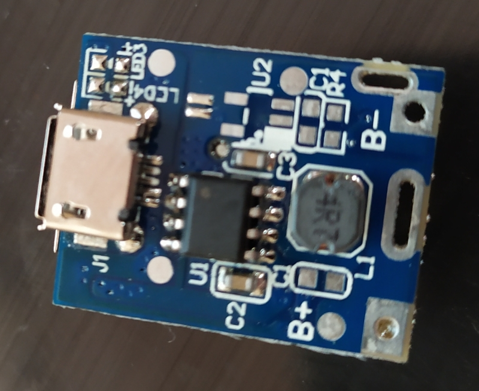

# Li-Ion-UPS-18650
Describe how to create simple, cheap and efficient UPS, based on 18650 Li-Ion batteris

Традиційні ББЖ/UPS досить ефективні коли мова йде за навантаження більше 100Вт і які потребують для своєї роботи 220в. Якщо ж мова йде за невеликі навантаження які в свою чергу оснащені БЖ на 5/9/12в, то наяність перетворювачів з 6/12 DC в 220 AC (частина UPS) і потім 220 AC в 5/9/12 DC (БЖ присторою) виглядає надлишковою. Опишу мої потугі щоб створити міні блок безперервного живлення (ББЖ) на базі Li-Ion 18650 акумуляторів які би одночасно заряджались і живили присторої на 5/9/12 В.

### Задача #1

#### YI Home Camera

Є IP-камера відеоспостереження YI Home Camera 720p. Є запис на MicroSD карточку.

Камера живиться по Micro USB. В комплекті іде БЖ з виходом 5В і 1А.

Стандартне споживання ~250mA. В нічному режимі із-за інфрачервоного підсвічування струм зростає до ~400mA.

Забезпечити можливість автономної роботи Wi-Fi камери.

 

 

### Версія #0.0

#### Контроллер TP4056 Для Li-Ion

Першим в руки попав контроллер для Li-Ion на базі TP4056.

Має вхід для 5В через Micro USB або можна найти версію з контактами на платі.

Cons: Відсутній захист від перезаряду і перерозряду батареї. Треба окремо BMS модуль для захисту батареї. Непередбачено одночасне підєднання навантаження і батареї. Використання можливе лише в варіанті CC/CD зарядного.

На тому експеременти з тим модулем завершились.

 
### Версія #0.1

#### Контроллер TP4056+DW01 Для Li-Ion

Для наступного експеременту пішла більш просунута версія Li-Ion контролера на базі TP4056 яка вже має модуль захисту батареї реалізований на чіпі DW01.

 

Чомусь помилково вирішив що даний модуль є завершеним рішенням і на виході дає 5В. 

Cons: На виході нема 5В. Отже, на вході 5В, на батареї напруга від <3 до 4,2в залежно від заряду батареї, на виході то саме що і на батареї. Батарея була заряджена і камера стартанула і працювала від ~4В. Напруга на виході не 5В.

### Версія #0.2

#### Контроллер TP4056+DW01 і MT3608

Отже для фіксання вихідної напруги контроллера TP4056+DW01 щоб на виході було 5В треба DC-DC StepUp. Під руками був лише регульований на базі MT3608.

До речі получилось рішення дуже подібне до того що описано в https://habr.com/ru/post/444076/

Досить адекватне рішення. Залишилось зібрати і протестувати, чи зможе це бути заміною UPS чи лише як повербанк рішення. Отже схема виглядає такою:

#### Вольтамперметр

Трошки відступу. Для того щоб зібрати інфу про детальну поведінку схеми треба періодично міряти струм і напругу у всіх точках схеми. Прбував використовувати мультиметр(и). Якщо напругу в якійсь точці ще можна міряти періодично мультиметром, то зі струмом проблематично, бо мультиметр сам вирубається що 15 хв. З найдешевшого в китайців був оцей вольтамперметр постійного струму.

Найшов в україні не набагато дорожче ніж в китайців. І варіант з Києва на завтра переміг варіант з Китаю за місяць (або два) хоча і був дорожчий на пару центів. Ще би Нова Пошта трохи менше дерла, можна би було взагалі з Китаю не замовляти. Так от чотири таких девайса запхано в кожну гілку, для моніторинга.

Cons: Дані модулі мають два варіанта підключення: з живленням від вимірюваної напруги і з зовнішнім живленням. В першому варіанті проблема що напруга має бути >4В (в реальності десь 3.0-3.2В), бо інакше маєм потухший екран. А при схемі з зовнішнім живленням вилізла бага. Я всі ВАметри підключив до одного БЖ на 9В, тобто у всіх виявились зєднані +/- живлення і це мало наслідки. Один з ВАметрів не показував струм. Другий нюанс з тими девайсами - вони показують лише струм з полярністю відповідною підключенню. Це не дуже добре для гілки з батареєю. Коли батарея заряжається струм заряду відображається, коли розряд батареї показує 0А.

#### Тестування

Для тестування був використаний якийсь нонейм Li-Ion акумулятор але з перевіреною ємністю 2500мАг. Батарея була заряджена повністю за допомогою зовнішнього зарядного. Тестування проводив вдень, тобто струм споживання камери 250мА. 

Відєднуєм вхідне живлення і ждем. Рівно 7 годин заняло щоб акумулятор розрядився з 4.2В до 3.0В. А далі напруга з 3.0В впала до 2.5В буквально за 2-3хв. При 2.5В  контролер відрубав навантаження. Напруга на акумуляторі почала підніматись. Коли вона відновилась до 2.9-3.0В контролер знову врубав навантаження і тим самим ще більше розрядив акум. Наступний раз відновлення напруги на акумі тривало 20хв....І так було 3 рази. Акум став досить посаджений, для його здоров'я це згубно. 

Відновлюєм вхідне живлення. Поведінка контролера виглядає логічною і передбачає, що акумулятори розряджені нижче ніж 3В треба початково заряджати невеликим постійним струмом 100мА до напруги 3В, а далі по схемі CC 1А і потім CD 4.2В. А тепер веселе. Акум повністю розряжений до 2.5-2.6В, контролер в режимі "розкачування" акума і має подавати 100мА на батарею, а він лімітує вхідне споживання від мережі 100мА і подає їх одночасно і на батарею і на навантаження!!! Наслідок, камері 100мА для роботи мало, вона не може нормально стартанути, на батарею нічого не лишається, навіть гріше камера забирає з батареї все що там ще лишилось, напруга на акумі падає, на 2.4В мені стало шкода акумулятора і я відєднав навантаження. Без навантаження, акумулятори досить швидко дозарядились до 3В і контролер почав замість 100мА давати повноцінний 1А. Без навантаження контролер зарадить акумулятор без проблем, але ж у нас UPS і цікавить поведінка в цьому режимі. Коли струм став 1А підключаєм знову камеру. Плата дико гріється до 85-90С, споживає рівно 1А і його ділить, 250мА на камеру і 750мА на батарею. Це десь нагадує CC режим зарядки, струмом 750мА. При 4.2В на батареї починає падати струм до нуля. Але LED що вказує що зарядка завершилась ніколи не засвічується, це вказує, що контролер перевіряє струми споживання, а не струм в гілці зарядки батареї.

Pros: Хоть якось працює. Все би було добре якби напруга на батареї не опускалась нижче 3В. 

Cons: Якщо довго нема живлення то в смерть розряжається акумулятор і при відновленні живлення невдається зарядити акумулятор.

### Версія #0.3

#### Контроллер TP4056+DW01 і MT3608 і Релє

Фіксаєм ішуси з попередньої схеми. Трохи погуглявши попало таке рішення https://ovcher.com/pitanie/prostoj-bbp.html Виглядає досить логічно. Переробляти по мінімуму - доліпити релюшку. Що насторожує вже це питання чи коректно рубане акум при досягненні нижньої межі. І друге це виглядає що струм заряду буде 1А і камера 250-400мА додатково, отже існуючий БЖ на 1А не стягне. 

#### Тестування

Схема зібрана, погнали. Цього разу не було бажання чекати 7 годин тому знайшов акумулятор від ліхтарика. Там виявився супереконом версія - 700 мАг. Батарею до повного заряджав схемою. З приємного - це батарея зарядилась і загорівся синій LED, що значить зарядка завершилась. Тестування проводив вдень, тобто струм споживання камери 250мА. Перше що вилізло це струм споживання, релюшка зжирала десь 150-180мА!!! 

І наступне, що вилізло також відразу - камера ішла в ребут при імітації пропадання/відновлення живлення. Причому що при виключенні вхідної напруги, що при відновленні. Тут пояснення поки нема, все ж таки по даташитах час спрацьовування релє дуже маленький.

Цього разу все відбулось за півтора години. Ще через 2 хв напруга впала до 2.5В і система відрубалась. А далі попередня проблема. Напруга досить швидко повертається до 2.9В і включається подача напруги на камеру. Камера стартує на 2-4 сек, навіть не встигає стартанути і акумулятор знову розряжається в 2.5В. Протягом 10хв це відбулось десь 15 разів і мені стало шкода камеру, незнаю чи шкодить чи ні такі дії камері. Як ці "качелі" виглядають є на відео https://youtu.be/TlYVMBAlbn4

Відновлення живлення. Камера класично ребутнулась. В той же час батарея підзарядилась 100мА током і після 3В перейшла в режим зарядки СС 1А. Як і передбачалось - споживання 1.4А. На акумулятор 1А, решта на камеру і релюшку. TP4506 як і раніше >70C. MT3608 холодна (бо протікає 250мА при декларованих 2А). Була думка замінити резистор відповідальний за струм заряду, щоб сумарний струм не перевищував 1А, але нема сенсу це робити при існуючих недоліках.

Не впевнений що з цього рішення можна витисснути ще щось більше, що би працювало адекватно. Хіба кого влаштовує то миритись з тими кейсами якщо не критично.

### Версія #0.4

#### Контроллер MH-CD42

Ще один цікавий варіант на базі MH-CD42. Не знаю з чим повязано але досить мало інфи по цій схемі. Досить не дорогий, навіть в україні ціна менше 2 доларів. Шо сподобалось - все на одній платі (навіть на одній мікросхемі): BMS і Upstep, ше і в додаток 4 LED для індикації рівня зяряду і кнопка вкл/викл. 

#### Тестування

Зібрати схему - реально 5 хв якщо все підрукою. Почав з супереконом акумулятора на 700 мАг. Система прожила як і в попередньому варіанті 1.5 год знову, заряд не тестував бо не хотів заряжати акумулятор струмом 1.5А - 1.8А що є 2-2.5С. Все що далі описано проводилось на акумуляторі 2500 мАг. Акумулятор повністю заряжений зовнішньою зарядкою. Всі 4 LED світяться і сигналізують про повний заряд батареї. Поїхали - power off. І перший недолік. камера пішла в ребут. Пізніше по доках знайшов що при переході на батарею іде пропадання напруги на виході на 0.3 сек. Цього досить щоб камера ребутнулась. З камерою на це можна закрити очі а от з Raspberry це не пройде. При відновленні живлення все йде поплану, нічо не вирубається. Тестування проводив вдень, тобто струм споживання камери 250мА. Система як і при попередніх експерементах прожила трохи більше 7 год. Сподобалось що акумулятор відрубався на напрузі 3.1 В, а не висаджувався без толку до 2.5В (з 3.1 В до 2.5 В це буквально 1-2 хв). Другий позитивний момент що нема ефекту "качель" - тобто підняття напруги на акумуляторі (при відсутності вхідної напруги) не призвело до включення навантаження. Навіть заміна на повністю заряджений акумулятор не призвела до старта. Але для цього на платі є кнопка якою можна примусово включити навантаження в режимі розрядки.

Відновлюєм вхідне живленняя. Струм споживання до 2А, на акумулятор іде мінус струм навантаження = 1,5А). Плата не гаряча - несь 40-50С. Досить швидко (менше години) акумулятор заряжається більш менш сталим струмом 1,5А до напруги 4 В (CC частина процесу, хоча цей процес мав би йти до напруги 4.2 В) а далі мала би йти класична CV частина з сталою напругою і зменшенням струму. А в цій платі це трошки мало відхилення, струм падав з 1,5А до 0А а напруга росла з 4В до 4.1 В струм. Відключення системи заряду відбулось на 4,1В. Підозрюю що недозарядилась батарея. Досить великий струм заряду дозволяє включити паралельно дві батареї з сумарною ємністю 5000-6000 мАг.

Cons: Якщо недозаряд акумулятора можна проігнорувати то вимкнення навантаження при переході на батарею незавжди. Для вирішення спробува приліпити на вихід кондюк, ні 100 ні 1000 мкФ не поміг. І друге це струм споживання буде 2А отже існуючий БЖ на 1А не стягне, треба купляти сторонній. 

PS: Замість конденсатора можна спробувати іоністор (суперконденсатор). Щось приблизно описане в https://mysku.ru/blog/ebay/35184.html Десь там і формула (дуже спрощена) проскакувала розрахунку ємності акумулятора. Отже що треба: 5В 0.5А 0.3сек = 0.75Дж. Енергія конденсатора = ємність * напруга * напруга. Або при розряді від 5В до 4В буде витрачено енергії = єиність * (5В^2 - 4В^2). Отже ємність іоністора достатньо 0.1 Фарад. 

PPS: Іоністор 0,1F 5,5V (SE-5R5-D104VYH) брав тут https://www.rcscomponents.kiev.ua/product/ionistor-0-1f-5-5v-se-5r5-d104vyh_122900.html підключив в паралель виходу. Непомогло і камера і далі йшла в ребут. Додав діод шотки перед конденсатором щоб іоністор не розряжався в сторону плати. Знову непомогло. Підозра на іоністор, а саме на його внутрішній опір який не дає достатній струм розряду.

PPPS: Клон IP5306 https://techobsessed.net/tag/mh-cd42/ І ще стороннього тестування https://mysku.ru/blog/china-stores/68926.html - проблема та ж, короткочасне пропадання виходу.

### Версія #0.5

#### Контроллер UPS 12v

Ще один цікавий варіант готового UPS модуля на 12в (є версія на 9в). Деяка інформація про принцип функціонування знайшов https://mysku.ru/blog/taobao/72616.html Хоча на моїй платі маркування мікросхем затерті, і назви неможливо ідентифікувати. Досить не дорогий, ціна в Китаї менше 2 доларів, в Україні нажаль не знайшов. Аналогічно до MH-CD42 все на одній платі: BMS і Upstep, ше і є місце для LED що є індикатором роботи і заряду батареї. 

#### Тестування

Схему досить проста для збору, прийшлось допаяти два світлодіоди. І працюють трохи інакше ніж в описі - червоний блимає - нема батареї; червоний горить - іде заряд; синій горить - підключено навантаження, при відєднаному навантаженні не світить. Оскільки готовий модуль на виході дає 12В (якщо розімкнути JP1 то буде 9В) тому прийшлось ще додавати StepDown LM2596, щоб було 5В. Якось система дивно себе вела, чомусь в один момент акумулятор був розряджений, прийдеться детальніше поковиряти. Отже подаєм живлення (використовував на вхід 9В) на модуль без батареї і без навантаження - червоний LED блимає. Підєднуєм батарею - червоний LED стабільно горить і сигналізує про заряд. Підєднав навантаження - загорівся синій LED. Батарея мала би бути заряджена з попередніх експериментів. Але для гарантії чекав 2 години. Напруга на батареї зросла до 4.19В але LED червоний не потух, може недочекався.

При відключенні вхідного живлення не відбувалось ребуту камери. Чи КПД мале чи недозаряджена батарея але непрожила система і 5 годин. Десь в районі 3 вольт на батареї відбулось відключення. А тепер цікаве! При відновленні живлення на виході плати було 8.9В, підозрюю специфіку роботи, не забуваєм що на вході БЖ з 9.2В. Протестую з БЖ на 12В, подивимось. Хоча згідно інструкції на вході може бути 6-12В. Трішки підзарядив акумулятор до 3.5В і відключив. Ще більш несподіваний результат. На виході плати 4.8В, і відповідно на виході LM2596 ще менше 4.0В. Хоча камера працює від 4В, але це ненормально. Дубль два - підзарядився акумулятор до 3,5В, відключаєм вхід, добре що камера не ребутається, але на виході плати знову 5В і на батареї напруга просіла до 3.4В. Відновлюю живлення - і оп камера в ребут, видно 4В на виході понижуючого модуля замало для камери щоб адекватно пережити переключення на вхідне живлення. Залишив в такому стані на ніч. Несподіванки продовжуються. Через 8 годин напруга на акумуляторі 3.75В, на виході плати вже 8.8В, а червоний світлодіод мигає але з набагато нижчою частотою ніж при відсутності батареї (десь 1-2 сек період), склалось враження що в момент коли світить заряжає, а коли потухший то бере з батареї. Спробувував вимкнути вхідну напругу (камера ребутнулась) і через пару секунд відновити і вуаля - на виході плати 12В, червоний лед горить, напруга на батареї зростає.

#### Тестування - дубль два

Експеремент розпочався з зарядки батареї. На початку експеременту на батареї було 3.6В, зарадка іде - напруга на батареї зростає червоний LED горить. На вході в плату 9.2В і струм споживання 300мА. На виході плати на DC-DC StepDown іде 12.2В і 100мА, ну і на камеру 5.1В і 220мА. Через 12 год - лед горить що значить батарея ще не заряджена, хоча напруга на батареї вже 4.19В. На вході 9.2В і 300мА як і було на початку. На виході також без змін 12В і 100мА. 24 години ситуація без змін. Через 36 год маєм сюрприз. Батарея розряжена - 3.08В, на виході плати 8.8В, струм від БЖ впав з 300мА до 200мА, червоний LED блимає з частотою 0.5Гц. Як це виглядає https://youtu.be/963-Z8T_fgI Нема сенсу продовжувати тестування при цих умовах. Розчарував мене модуль, хоча не відкидаю браку. Чекаю ще одну таку саму плату. Спробую ще тест на БЖ 12В

#### Тестування - дубль три

Для тесту змінив БЖ. Тепер на вхід плати замість 9В буду подавати 12В. Надіюсь будуть зміни, хоча згідно запевнень кітайців плата має одинаково працювати в діапазоні вхідних напруг 6-12В. Отже на початку тесту - батарея 3.08В, вхід плати 12.5В і 350мА, вихід плати 12.2В і 110мА і на камеру іде 5.1В і 220мА. І перша позитивна зміна. Через 8 годин червоний LED потух, що свідчить що зарядка завершена. Після завершення зарядки - на вході плати 12.5В і споживання 150мА, вихід плати 12.2В і 110мА, на камеру 5.1В і 210мА, на батареї 4.15В (трохи недозаряд)

Вимикаєм живлення. Перехід на камеру відбувся без ребута камери. Відразу ж напруга на батареї просіла з 4.15В до 4.04В. Виглядає на серйозний недозаряд батареї. Розряд ішов лінійно, напруга на батареї рівномірно падала з кроком 0.15В - 0.1В / 30 хв. Через 4 години на батареї залишалось 3,23В і на виході плати все ще було 12.6В і струм 100мА і камера ще працювала. За наступні 10-15 хв напруга на батареї просіла до 3.1В - 3.15В і в результаті плата почала на виході давати 4В і показувала струм віддачі 70мА, на виході LM2596 і того менше, LED на камері світився, але вона не реагувала. Ще 15-20 хв коли напруга на батареї опустилась до 3.04В плата повністю відключилась.

Pros: При переході на батарею не було перегрузки камери. Індикатор повного заряду спрацював. Можна окремо розглянути для 12В пристроїв.

Cons: Більш менш адекватно вела себе лише при 12В на вході. Недозаряд батареї, робота 4год замість 7 год. Потреба в DC-DC StepDown.

### Версія #0.6

#### Модуль UPS 5v на базі 4056

Наступний клієнт на тестування. Готовий UPS модуль на 5в (є версії на 6, 9, 12в). Деяка інформація про модуль є https://ovcher.com/pitanie/bbp-alternativa.html Досить не дорогий, ціна в Китаї менше 2 доларів, цей що тестую брав в україні десь по ціні 4 долари. Кітайці на своїх сайтах малюють зразу підключення до батареї, хоча насправді для батареї потрібен BMS. Upstep є на платі. Є LEDи для індикації роботи і заряду батареї. 

#### Тестування

Схему досить проста для збору, правда перший раз не звернув увагу і завтикав що плата НЕ має BMS для захисту батареї, і перший експеримент завершився повною розрядкою батареї до 2.15В. Згідно опису на сайті продавців, BMS треба лише для контролю перерозряду, а заряд значить контролює плата. На платі є два LED: червоний горить коли іде заряд, при завершенні червоний гасне і горить зелений. Перший неприємний дзвіночок це заряд батареї при підключеній камері. Скільки би не чекав, плата не переходила в режим повного заряду. Червоний LED горів постійно. Відключивши навантаження плата за хвилину перейшла в режим повного заряду: червоний LED потух, зелений загорівся.

Тестування проводились з BMS 1S. Відключення живлення при зарядженій батареї не призводило до ребуту камери, що давалю +1 в карму цієї плати. Для 2500мАг батареї час автономного живлення склав 7+ год, що дуже добре. При 2.5В на батареї BMS відєднав її від контролера. А далі знову неприємні "качелі" про які згадувалось раніше. Напруга на батареї підновлювалась до рівня 2.9В і стартував контролер. Далі пару десятків секунд працював і на 2.5В відключався. Так було 3 рази. На батареї 700мАг "качелі" були більш виражені. до 10 разів, і тривалість відновлення до 20-30 сек і час роботи 3-4 сек. На 2500мАг батареї качелі зауважив навіть через 24год. 

Модуль на 4056 чіпі отже має також "фішку" попереднього дозаряду батареї малим струмом. Вимикаєм живленні і чекаєм розряду батареї до 2.5В. Як тільки модуль відєднався, напруга на батареї починає відновлюватись, і чим скоріше відновлюю подачу напруги. Мені вдалось подати напругу при 2.6В на батареї. Камера включилась, правда на вході камери було десь 3В і камера хоть стартанула але не функціонувала. Плата споживала від мережі 130мА і майже весь цей струм ішов на камеру, батарея дуже повільно набирала ємність. Через 12 год напруга піднялась з 2.6В до 2.88В, і зарядка на повну так і не стартанула. Виглядає що недочекався зовсім трішки. Відєднавши камеру на секунду, плата стартанула на повну і в момент напруга на батареї перейшла позначку 3В (є підозра що 2.9В це напруга переходу в режим заряду СС, і друге це невідомо як себе би повела камера, вона була в непрацюючому режимі при 3В і підняття до 5В могло її так і залишити в зависшому стані). Максимальний струм споживання був 900мА (на камеру 230мА рещта на батарею). Класично що 4056 грілася і температура при зарядці 70-80С.

Pros: При переході на батарею не ребутається камера. 

Cons: Треба окремо BMS. Індикатор повного заряда не працює належним чином. "Качелі" з включенням/виключенням навантаження. Прблеми з зарядкою при повному розряді батареї.

### Версія #0.7

#### Модуль UPS 5v з холдером для 18650 батареї

Гарне закінчене рішення. UPS модуль зі всім в комплекті на 5в. Має навіть холдер для 18650 акумулятора. Є версія на 12в. Трохи дорожчий ніж попередні, ціна в Китаї менше 3 доларів. Нажаль так і не вдалось найти ні опису ні схеми підключення. Всі маркування на китайській мові. Прийшлось методом проб підключати. Плата має 6 площадок для підпайки, на китайській мові - тому вгадуєм. Контакти подачі 5в логічно знаходились біля MicroUSD гнізда і легко продзвонились. Вихід найшовся не відразу, на жодних контактах не було 5в. Виявляється що посередині плати є перемичка - це свого роду вмикач навантаження, треба було замкнути. Прийшлось пошукати і підпаяти два піни щоб при потребі можна було приліпити вимикач. Отже при замкнутих контактах вихід працює без батареї. Логічно би було припустити що останні два контакти це для зовнішньої батареї. Можливо, але ці контакти не були запаралелені до холдера батареї. Тому все ще під питанням що це. Раз батарейнийвідсік впаюється напряму в плату то BMS не треба. Є три LEDи для індикації навантаження - зеленийб червоний для індикації заряду батареї і зелений що заряд завершено. Нажаль аркування мікросхем затерте, але велика підозра що це та сама 4056.

#### Тестування

Трошки магії з паяльником і ставим на зарядку з підєднаною камерою. Бага номер один - постійно горить червоний LED що йде зарядка, споживання від БЖ 330мА на камеру 230мА, десь 100мА по платі гуляє. Модуль не переходить в режим заряджено. Якщо відєднати камеру то за секунду загорається зелений LED що зарядка завершена і споживання від БЖ 0мА. Вертаєм назад камеру, зелений LED далі горить, споживання 0мА, камера працює і споживає 230мА. Звідки? Видно від батареї, бо за трошки батарея підсіла і модуль перейшов в режим зарядки. Без жодних ребутів модуль переходив на роботу від батареї і назад від БЖ і жодного разу камера не ребутнулась. На 2500мАг батареї камера протрималась понад 7 год. При напрузі 2.6В модуль відключив навантаження, батарея досить швидко відновила напругу до 2.9В і модуль знову включив камеру. Я вже згадував раніше за ці "качелі", і тут вони також є. При відновленні живлення, якщо напруга батареї менше 3В відбувається класична для 4056 зарядка малим струмом 100мА, але по аналогії до попередників це споживання на вході, а не на батарею. І ті 100мА всі ідуть на камеру, в результаті ні камера не працює ні батарея не заряжається. Тільки відєднання камери дозволяє вивести модуль з цієї патової ситуації.

Pros: При переході на батарею не ребутається камера. Закінчений модуль який не потребую інших доробок.

Cons: Індикатор повного заряда не працює належним чином. "Качелі" з включенням/виключенням навантаження. Прблеми з зарядкою при повному розряді батареї.

### Версія #0.8

#### Контроллер TP4056+DW01 і MT3608 і Діоди Шотки

Ще одна спроба пофіксати проблеми з зплатою TP4056 + MT3608, це продовження модернізації Версій #0.2 і #0.3. Отже з версії #0.2 випливає що при наявності живлення на вході потрібно від'єднувати навантаження від модуля і пропускати напряму. Таким чином з'явилась версія #0.3 з релє. Нажаль механічне реле має відчутний струм споживання і великий час спрацьовування який призводив до ребуту камери. Досить елементарно можна реалізувати реле з використанням транзисторів. Першою на очі попала стаття https://www.drive2.ru/communities/9/forum/497391573688909892 де зображено схематично реалізацію перемикаючого реле використаного в Версії #0.3. 

Вже планував реалізовувати, відтворив і перевірив схему в симуляторі плат. Але Тарас Рудько мене вчасно зупинив давши https://www.radiokot.ru/artfiles/6514/ почитати. Нажаль мого досвіду замало було, щоб без його підказок нормально зрозуміти цю схему. Отже, підказка позначена оранжевим.

Саме ці елементи і відповідають щоб живлення з входу попадало на навантаження минуючи TP4056. В своїй реалізації я використав два діода шотки 1N5817.

#### Тестування

Простенька схема, швиденько заімплементав. Для тестування був використаний все той же нонейм Li-Ion акумулятор, але з перевіреною ємністю 2500мАг. Батарея майже заряджена. Підєднуєм живлення, ждем пару хвилин і опа, плата засигналізувала що акумулятор повністю зарядився. Починаєм експеримент. Від'єднуєм вхідне живлення і ждем. Ура! Ребуту камери не відбулось. Зразу додам що тестування пропадання/відновлення вхідної напруги жодного разу не призвело до ребуту камери, навіть при розрядженій до 3В батареї. Порівняно з Версія #0.2 система прожила трохи менше. Якщо раніше це було 7 годин то тепер із за втрат на діоді час автономної роботи зменшився і склав 6 з половиною годин. При 2.5В контролер відрубав навантаження. Напруга на акумуляторі почала підніматись. Коли вона відновилась до 2.9-3.0В контролер знову врубав навантаження і тим самим ще більше розрядив акум. І так декілька разів, повністю аналогічно до Версій #0.2 і #0.3 що для здоров'я акумулятора згубно. 

Відновлюєм вхідне живлення. Поведінка контролера виглядає логічною і передбачає, що акумулятори розряджені нижче ніж 3В треба початково заряджати невеликим постійним струмом 100мА до напруги 3В, в цей же час камера вже розпочала свою роботу беручи живлення з входу. Через декілька хвилин зарядка пішла по схемі CC 1А. Плата класично почала грітись до 85 градусів, споживання входу зросло до 1.3А що є нормально - 1А на зарядку акумулятора і 300мА на камеру. При досягненні 4.2В плата адекватно дозарядила акумулятор по схемі CD і потім просигналізувала про повну зарядку акумулятора. Отже в час зарядки акумулятора по CC схемі штатного БЖ 1А не хватить, треба додатково модель на 2А.

Pros: Перше повністю працююче (як би ще "качель" не було) згідно вимог рішення.  

Cons: Для ідеального рішення ще би ідеально було якби напруга на батареї не опускалась нижче 3В. Втрата КПД до 5-10% яка компенсується більшою батареєю. Рідне зарядне має замалу потужність.

#### Продакшен

Якщо все під руками то зібрати кінцевий девайс не більше години. Отже що було підруками: Плати на TP4056+DW01 і MT3608. Два діоди шотки 1N5817, папа і мама USB розєм на кабель, тримач батареї 18650 і корпус куда то все влазить.

Перший крок - зпаяти 

Другий крок - впхати в корпус

Крок третій - перевірка в дії

### Версія #0.9

#### Контроллер TP5000+DW01 і MT3608 і Діоди Шотки

TP5000 сучасніша і більш потужна заміна мікросхеми TP4056. Має можливість заряджати струмом до 2А, а також вхідне живлення може бути до 9В. Всі реалізації на основі цієї плати які попадались призначені суто для сценарію зарядки батареї. Дефолтна плата налаштована на струм заряду 1А. Для струму в 2А треба допаяти SMD резистор 0,1 Ом якого під рукою нема. Хоч і плата має вбудований BMS але лише для заряду бо плата не передбачає використання в режимі розряду. Для реалізації UPS треба буде зовнішній модуль BMS наприклад на DW01. І зєднати все по схемі з Версії 0.8

Вернусь до модуля коли зроблю 2А.

### Задача #2

#### 12В Wi-Fi Router 

Є Wi-Fi роутер чи ADSL модем чи будь який інший малопотужний пристрій до 5 Вт. Навіть Led ленти освітлення можна в список додати.

Для тесту є декілька пристроїв: Роутери TP-Link, Kinetic, медіконвертори і т.д. з Живленням 12В.

Середнє споживання ~250-400 mA.

Задача забезпечити можливість автономної роботи при відсутності вхідної напруги (УкрТелеКом і X-My.Net функціонують при відсутності напруги).

 

 

### Версія #0.0

#### Контроллер TP4056+DW01 і MT3608 і Діоди Шотки, з налаштуванням на 12В

Як каже програмістська мудрість працює не рухай (якщо ненаписав юніт-тестів :-) ). Тому було використно вже робочу схему з різницею що MT3608 налаштувати на 12В а не 5В.

Схема, фото і елементна база, така сама як і "Версія 0.8", тому без неї. Єдине з акцентую БЖ на вході як і раніше 5В, бо TP4056 іншого не їсть.

Зразу з фіналу: навіть не стартануло. Отже, на нагрузці з споживанням 400 мА, без Li-Ion батарей, тобто весь струм з БЖ йшов на навантаження, БЖ зразу йшов в захист. При зменшенні навантаження до 200 мА, БЖ жив на максимумі своїх можливостейЖ 1.6 А на 5 В. Діоди шотки зразу дико нагрівались, і також працювали на грані фолу. І виглядає що в такому режимі КПД МТ3608 падає аж чи не до 70%. І це при 5В на вході. При живленні від акума, навіть не повністю розрядженого 3,5 В струми будуть ще більші.

Cons: Не ефективне перетворення з 5 в 12 В, великі струми, потужний БЖ.

На тому експеременти з тим модулем завершились.

### Версія #0.1

#### Контроллер TP5100+FC???? і MT3608 і Діоди Шотки

З попередньої версії висновок: використовувати 5 В схемотехніку для 12 В навантаження дуже нераціонально. Є в китайців ще одна платка на ту тему - TP5100. З основного: струм заряду батарей до 2А, можливість роботи як з одним акумулятором так і з двома послідовно зєднаними - так звана схема 2S. Вхідне живлення до 18 В. Нажаль немає схеми захисту акумулятора - прийдеться клеїти :-) окрему.   

Один з перших що попав на очі і досить таки адекватним є огляд https://mysku.ru/blog/china-stores/80930.html Правда там ставлять під сумнів струм заряду в 2А. І згадують за цікаві глюки при роботі з одним акумулятором. В мому варіанті зразу випаяв один резистор, на платі в паралель стоїть два по 0.1 Ом (паралельний опір 0,05 Ом) що відповідає 2А струму зарядки. Один резистор забезпечить 1А струм заряду. Для двох 3000 mAh акумів це 3 години що досить нормуль. І замкнув перемичку що відповідає за 2S режим (8.4 В)

 

Кого тягне хардкор - є даташит на китайській мові https://www.microlab.info/wp-content/uploads/sites/5/2018/06/TP5100-CN.pdf або [тут](TP5100-CN.pdf) Гугль як на диво досить внятно може його перевести на українську. Я ще до цього даташиту вернусь пізніше. Там є дещо цікаве. 

На відміну від TP4056 ця TP5100 немає на борту BMS контролера. На Аліекспресі BMS 2S два вагона. Звичайно огляди читаються після. Я взяв одну з найдешевших і розрахованих на відносно низький струм (3 А) плату з маркуванням FDC-2S-2

Огляд (правда з купою граматичних помилок) є на https://mysku.ru/blog/aliexpress/49071.html При виборі керувався лише мінімальна ціна і забезпечує струм необхідний. Коли бавився з тою платою відкрив для себе один нюанс на який раніше ніколи не звертав уваги. Мені просто везло і там де треба попадала необхідна версія BMS. Так от всі BMS можуть бути задизайнені під два режими (може і більше є, невникав): 1) Для "розблоковування" BMS після короткого замикання чи захисту від перерозряду батареї їм необхідно подати на вхід напругу; 2) BMS які само розблоковуються через якийсь час (0.1-1 сек) після короткого замикання чи блокування акумуляторів.
Так от тип 1 не годиться для всяких ліхтариків чи шуроповертів. Я переробляв два "шуріка" на літій і там часто буває що при старті або при зупинці шпинделя BMS іде в захист. І якщо би треба було подавати живлення (включати на зарядку) для розблоковки то це би був ад. Там потрібно 2-ий тип. Так от ця плата якраз першого типу. А це дає в схемі переваги: немає "качель" які згадувались в TP4056. Якщо батарея розрядилась, то все, плата повторно стартане лише коли появиться вхідна напруга. Для режиму UPS саме то що треба.

Крім того для живлення взяв БЖ 12В, теоретично і 9В мав би працювати. MT3608 налаштована на 12 В на виході. Ну і по аналогії з "Версія 0.8" треба два діода шоткі. Брав ті самі 1N5817. Як все виглядало на схемі

#### Тестування

TODO

Простенька схема, швиденько заімплементав. Для тестування було використано два Li-Ion акумулятори Litokala, з ємністю 3000мАг. Батареї майже заряджені. Цього разу дожився до активного регульованого навантаження яке виставив на 400 mA. Від акумуляторів схема не завелась, бо BMS було заблоковане. Підєднуєм живлення, ждем пару хвилин і плата засигналізувала що акумулятор повністю зарядився (на платі є свої впаяні світлодіоди). Починаєм експеримент. Від'єднуєм вхідне живлення і ждем. Явного пропадання напруги не було та і звідки йому взятись, діоди спрацьовують моментально. 

Відновлюєм вхідне живлення. Поведінка контролера виглядає логічною і передбачає, що акумулятори розряджені нижче ніж 3В треба початково заряджати невеликим постійним струмом 100мА до напруги 3В, в цей же час камера вже розпочала свою роботу беручи живлення з входу. Через декілька хвилин зарядка пішла по схемі CC 1А. Плата класично почала грітись до 85 градусів, споживання входу зросло до 1.3А що є нормально - 1А на зарядку акумулятора і 300мА на камеру. При досягненні 4.2В плата адекватно дозарядила акумулятор по схемі CD і потім просигналізувала про повну зарядку акумулятора. Отже в час зарядки акумулятора по CC схемі штатного БЖ 1А не хватить, треба додатково модель на 2А.

Pros: Перше повністю працююче (як би ще "качель" не було) згідно вимог рішення.  

Cons: Для ідеального рішення ще би ідеально було якби напруга на батареї не опускалась нижче 3В. Втрата КПД до 5-10% яка компенсується більшою батареєю. Рідне зарядне має замалу потужність.

#### Продакшен

Якщо все під руками то зібрати кінцевий девайс не більше години. Отже що було підруками: Плати на TP4056+DW01 і MT3608. Два діоди шотки 1N5817, папа і мама USB розєм на кабель, тримач батареї 18650 і корпус куда то все влазить.

Перший крок - зпаяти 

